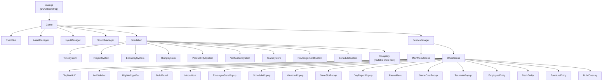
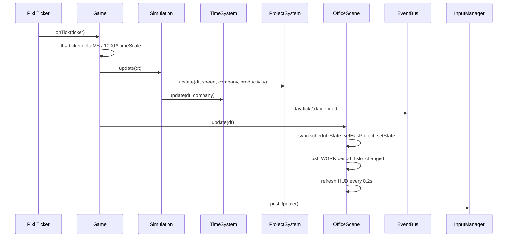
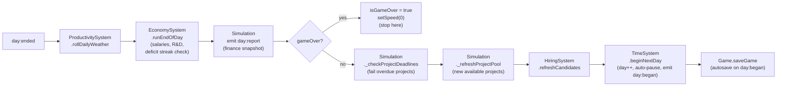
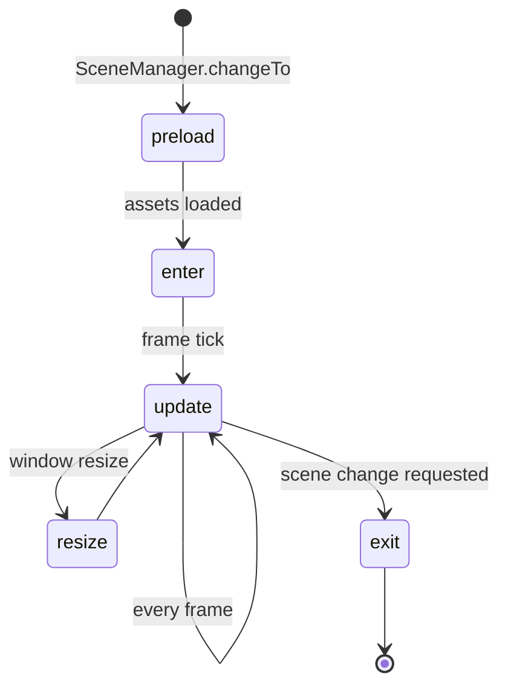

# Software Empire — Architecture

This document describes the technical structure of the game: how objects are wired together, how the frame loop works, how state is managed, and how the various UI layers compose.

---

## Top-Level Object Graph



All objects share the single `game` instance. `EventBus` (`game.events`) is the only cross-cutting communication channel; nothing imports another module's instance directly except via `game`.

---

## Frame Loop (Execution Model)



`dt` is real seconds already multiplied by `GameConfig.loop.timeScale`. The game-speed multiplier (`TimeSystem.gameSpeed`) is applied inside each system, not at the ticker level — this lets the HUD and input remain responsive while the simulation is paused.

---

## EventBus

`src/utils/EventBus.js` — a lightweight `Map`-based pub/sub. Listeners registered via `BaseScene.listen()` are automatically unsubscribed when the scene exits.

### Event Catalog

| Event | Emitter(s) | Payload | Primary Listeners |
|---|---|---|---|
|| `game:ready` | `Game.init` | — | — |
|| `resize` | `Game._onResize` | `{ width, height }` | — |
|| `scene:changed` | `SceneManager.changeTo` | `{ name }` | — |
|| `simulation:reset` | `Simulation.reset` | `{ company }` | `OfficeScene` |
|| `day:tick` | `TimeSystem.update` | `{ progress, company }` | — |
|| `day:ended` | `TimeSystem._endDay` | `{ day, company }` | `Simulation` (end-of-day chain) |
|| `day:began` | `TimeSystem.beginNextDay` | `{ day, company }` | `OfficeScene`, `Game` (autosave) |
|| `notification:add` | Multiple (see below) | `{ text, type }` | `NotificationSystem`, `OfficeScene` |
|| `project:accepted` | `Simulation.acceptProject` | `{ project, company }` | `OfficeScene` |
|| `project:rejected` | `Simulation.rejectProject` | `{ project, company }` | — |
|| `project:completed` | `ProjectSystem.flushWorkPeriod` (ready) **and** `Simulation.finishProject` (collected) | `{ project, company }` | `OfficeScene` |
|| `project:failed` | `Simulation._checkProjectDeadlines` | `{ project, company }` | `OfficeScene` |
|| `employee:hired` | `HiringSystem.hire` | `{ employee, company }` | `OfficeScene` |
|| `employee:fired` | `HiringSystem.fire` | `{ employee, company }` | `OfficeScene` |
|| `employee:levelup` | `ProjectSystem.flushWorkPeriod` | `{ employee, company }` | `OfficeScene` |
|| `desk:placed` | `Simulation.placeDeskAtTile` | `{ company }` | `OfficeScene` |
|| `desk:removed` | `Simulation.removeDeskAtTile` | `{ company }` | `OfficeScene` |
|| `research:unlocked` | `Simulation.unlockResearch` | `{ nodeId, company }` | `OfficeScene` |
|| `hiring:pool_refreshed` | `Simulation.unlockResearch` (qualifying nodes) | `{ company }` | `OfficeScene` |
|| `day:report` | `Simulation._wireDayCycle` | `{ day, moneyEnd, daysInDeficit, graceDays, gameOver, notifications, spProductivity, company }` | `OfficeScene` → `DayReportPopup` |
|| `economy:gameover` | `EconomySystem.runEndOfDay` | `{ company }` | notification + toast only; game-over UX driven by `day:report.gameOver` |

`notification:add` is emitted by: `Simulation` (project actions, desk, research), `EconomySystem` (salary, low funds, deficit streak warning, insolvency), `HiringSystem` (hire/fire), `ProjectSystem` (project ready), `NotificationSystem` (ring buffer), and `HiringPanel` (hire failure).

---

## Simulation & Systems

`Simulation` (`src/systems/Simulation.js`) is the coordinator. It owns the `Company` object and all subsystems. It exposes player-action methods to the UI (`acceptProject`, `finishProject`, `hireCandidate`, `assignEmployee`, etc.).

### End-of-Day Pipeline

When `TimeSystem` emits `day:ended`, `Simulation` fires all handlers in order:



### Per-Frame Work (`ProjectSystem.update`)

Runs every frame when `speed > 0`. For each employee in a WORK slot with a valid `pinnedProjectId`:

1. Find the pinned project in `activeProjects` (must not be completed or ready).
2. Compute `workPeriodFraction = (dt × speed) / workPeriodSec`.
3. For each matching skill: `contribution = SKILL_SP_TABLE[level] × workPeriodFraction × totalProductivity` (see [`PRODUCTIVITY.md`](PRODUCTIVITY.md) for the full formula).
4. Buffer the contribution into `employee.workBuffer[projectId][skill]`.

Points are **not written to the project directly** — they sit in `workBuffer` until `flushWorkPeriod` is called at the end of each WORK slot (detected by `OfficeScene` via slot index change).

---

## State Layer

All mutable game state lives in plain JavaScript objects under `src/state/`. No classes, no ORM — just factory functions that return typed object literals. Systems mutate these objects directly.

```
src/state/
  Company.js      — Root aggregate; owns all arrays below
  Employee.js     — Per-employee skills, pins, buffers, scheduleState
  Project.js      — Per-requirement progress, lifecycle flags (includes difficulty)
  Office.js       — Desk count, tier index, deskTiles array
  Candidate.js    — Hire pool entry
  Team.js         — Team (lead + member IDs)
  FurnitureItem.js — Placed furniture on the tile grid
  relationships.js — Pairwise friendship helpers and TALK interaction logic
```

### Company Object (top-level fields)

| Field | Type | Description |
|---|---|---|
|| `name` | string | Company display name |
|| `money` | number | Current cash |
|| `day` | number | Current day number |
|| `maxActiveProjects` | number | Concurrent project cap |
|| `office` | Office | Desk count and tier |
|| `employees` | Employee[] | All hired staff |
|| `activeProjects` | Project[] | Accepted, in-progress |
|| `availableProjects` | Project[] | Offered this day |
|| `completedProjects` | Project[] | Collected history |
|| `candidates` | Candidate[] | Programmer hire pool (refreshed daily) |
|| `otherCandidates` | Candidate[] | Team Lead + PM hire pool (refreshed daily) |
|| `pendingPayout` | number | Legacy field; `finishProject` pays directly; flushed by `EconomySystem` as safety net |
|| `rdPoints` | number | Research currency |
|| `rdPointsPerDay` | number | Daily R&D accrual rate |
|| `unlockedResearch` | string[] | Unlocked node IDs |
|| `schedule` | `{startHour, workHours}` | Work shift config |
|| `stats` | `{totalRevenue, totalSalariesPaid, projectsCompleted}` | Cumulative stats |
|| `currentWeather` | WeatherType \| null | Today's weather roll |
|| `teams` | Team[] | Active teams (one per hired Team Lead) |
|| `furniture` | FurnitureItem[] | Placed furniture on the office floor |
|| `relationships` | `{[key]: {friendship}}` | Pairwise employee friendship scores (updated on TALK) |
|| `daysInDeficit` | number | Consecutive end-of-days with negative cash; reset to 0 when ≥ 0 at EOD |

---

## Scene Lifecycle



`BaseScene.listen(event, handler)` registers a handler on the EventBus and tracks it so all subscriptions are torn down automatically in `_shutdown` (called by `SceneManager` before `exit`). This prevents event listener leaks across scene transitions.

---

## Entity / World Rendering

The office world is a flat Pixi `Container` (`_world`) with no camera or transform — all positions are absolute pixel coordinates derived from desk index, sidebar offsets, and the top bar height.

```
_world
  ├── _floor (Graphics — solid background rect)
  ├── _grid  (Graphics — dot grid lines)
  ├── DeskEntity × N      (128×128 px desk + monitor, tile-placed)
  ├── FurnitureEntity × N (decorative furniture, tile-placed via build mode)
  └── EmployeeEntity × N  (sprite + name label + schedule icon)
```

`OfficeScene._rebuildOffice()` tears down and recreates all entities whenever the employee roster or desk count changes (`desk:placed`, `desk:removed`, `employee:hired`, `employee:fired`). Entity positions are derived from `company.office.deskTiles` coordinates.

Each frame, `OfficeScene.update()` pushes state into each `EmployeeEntity`:
- `setState('idle' | 'typing')` — visual body color
- `setHasProject(bool)` — uses `pinnedProjectId !== null`; controls ⚠ vs schedule icon
- `setScheduleState('WORK' | 'BREAK' | 'TALK')` — controls schedule icon when assigned

---

## UI Layers

The stage is built as five stacked Pixi containers, from bottom to top:

```
root
  ├── _world          ← office floor, desks, employees, furniture
  ├── _buildOverlay   ← BuildOverlay (tile highlight + drag ghost, build mode only)
  ├── _popupLayer     ← EmployeeStatsPopup, SchedulePopup, WeatherPopup, SaveSlotPopup, DayReportPopup
  ├── _modalLayer     ← ModalHost (Projects / Staff / Hiring / Assignments / Research / Game Guide / Teams)
  ├── _hudLayer       ← TopBarHUD, LeftSidebar, RightWidgetBar / BuildPanel
  └── _toastLayer     ← Toast notifications
```

HUD and toasts always render above modals; modals always render above world-space popups. `BuildPanel` replaces `RightWidgetBar` in the HUD layer while build mode is active.

### Modal / Panel Contract

Modal panels (hosted by `ModalHost`) must implement:

| Method | When called |
|---|---|
|| `init(x, y, width, height)` | First open |
|| `resize(x, y, width, height)` | Window resize while open |
|| `refresh()` | Called by `OfficeScene` every 0.2 s and on relevant events |

`refresh()` does a full tear-down and rebuild of the panel's child display list — straightforward to implement and always correct, at the cost of GC pressure on fast refresh cycles.

### HUD Refresh

`OfficeScene.update()` accumulates `_hudRefreshAcc` and calls `refresh()` on all HUD widgets every 0.2 s. This decouples HUD rendering from the 60 FPS tick rate and avoids redrawing text every frame.

---

## Data Layer

Static, read-only seed data lives in `src/data/`. None of these files have side effects; they export frozen arrays/objects or are pure JSON.

| File | Contents |
|---|---|
|| `skills.js` | Skill IDs, labels, colors, research node mapping |
|| `projectCatalog.json` | Project flavor data (name, description, tier, required skills) — all numeric values generated at runtime |
|| `economyBalance.json` | Economy constants from PLOT.md: SP value ($100/SP), salary ratio (40%), difficulty multipliers, tier config |
|| `employeeCatalog.json` | Names for the starter employee and starter candidate pool |
|| `researchNodes.js` | 18 research nodes with costs, icons, dependencies |
|| `weatherTypes.js` | 5 weather states with productivity modifiers |
|| `officeTiers.js` | Office tier definitions (tier 1–5) |
|| `namePool.js` | First/last name lists for procedural candidate generation |
|| `starter.js` | Starting company constants (money, day, office tier) |

Balance helpers and generators live outside `src/data/`:

| Module | Role |
|---|---|
|| `src/economy/balance.js` | Pure functions: `computeMedianSalary`, `computeMedianPayout`, `computeProjectTiming`, `computeTeamOutput`, `pickDifficulty`, `getDifficultyConfig` |
|| `src/systems/EmployeeGenerator.js` | Builds candidates with 1–2 random skills (levels 1–5) and a median salary derived from their SP |
|| `src/systems/ProjectGenerator.js` | Combines a catalog entry with team-output-based SP, payout, insurance, and milestones at runtime |

---

## Configuration Reference (`src/config.js`)

`GameConfig` is a deeply frozen object. All gameplay tunables live here.

| Key | Value | Description |
|---|---|---|
|| `DAY_DURATION_SECONDS` | 180 | Real seconds per in-game day at 1× |
|| `SKILL_SP_TABLE` | `[0,1,2,4,6,9,12,16,21,28,36]` | Story points per skill level per WORK period |
|| `SPEED_PRESETS` | `[0,1,2,4,8]` | Valid game speed multipliers |
|| `DEFAULT_SPEED` | 0 | Speed on scene entry (paused) |
|| `AVAILABLE_PROJECT_POOL_SIZE` | 5 | Max offered projects per day |
|| `CANDIDATE_POOL_SIZE` | 4 | Legacy constant; actual pool size comes from `getCandidatePoolSize()` in `hiringResearch.js` (3 / 4 / 5 based on HR research) |
|| `MONEY_WARNING_THRESHOLD` | 5000 | Low-funds notification threshold |
|| `NEGATIVE_CASH_GRACE_DAYS` | 3 | Base consecutive negative-cash EODs before insolvency; extended by Reserve Fund research via `getNegativeCashGraceDays` in `src/data/lifeResearch.js` |
|| `BANKRUPTCY_THRESHOLD` | 0 | *Legacy — unused.* Active insolvency logic uses `daysInDeficit` instead. |
|| `ACTIVITY_LOG_MAX` | 100 | Notification ring buffer capacity |
|| `BASE_PRODUCTIVITY_MIN` | 0.85 | Min innate productivity trait — see [`PRODUCTIVITY.md §6`](PRODUCTIVITY.md#6-configuration) |
|| `BASE_PRODUCTIVITY_MAX` | 1.05 | Max innate productivity trait — see [`PRODUCTIVITY.md §6`](PRODUCTIVITY.md#6-configuration) |

---

## Path Aliases (`vite.config.js`)

| Alias | Resolves to |
|---|---|
|| `@` | `src/` |
|| `@assets` | `src/assets/` |
|| `@scenes` | `src/scenes/` |
|| `@ui` | `src/ui/` |
|| `@systems` | `src/systems/` |
|| `@entities` | `src/entities/` |
|| `@managers` | `src/managers/` |
|| `@utils` | `src/utils/` |
