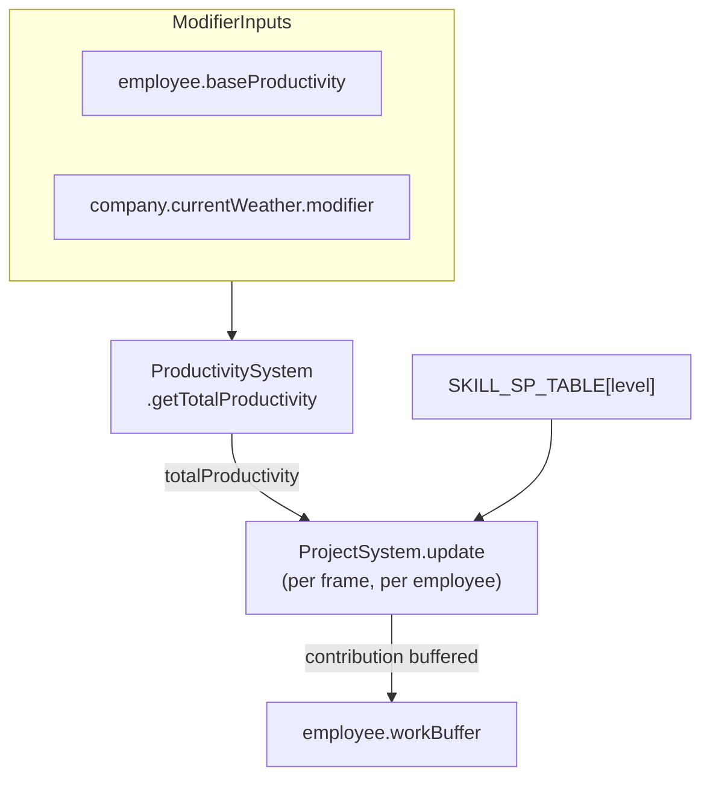
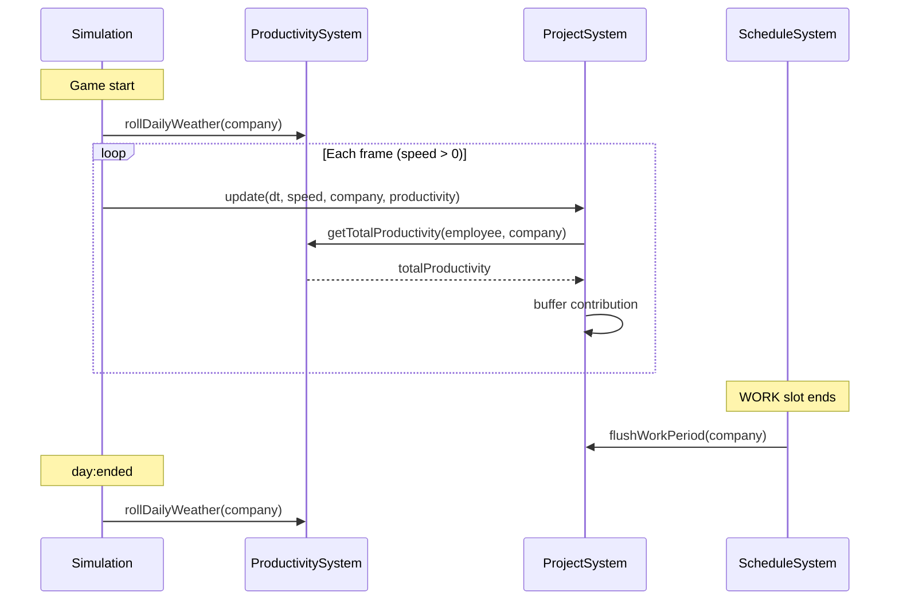

# Software Design Document — Productivity

**Status:** Living document — updated as the productivity model evolves.

> **This is the single authoritative source for the productivity formula and modifier model.**
> All other docs and source comments must link here rather than duplicate formulas or modifier tables.

---

## Table of Contents

1. [Purpose & Scope](#1-purpose--scope)
2. [Canonical Formulas](#2-canonical-formulas)
3. [Modifier Catalog (Implemented)](#3-modifier-catalog-implemented)
4. [Stacking & Extension Rules](#4-stacking--extension-rules)
5. [Lifecycle & Integration](#5-lifecycle--integration)
6. [Configuration](#6-configuration)
7. [UI Surfacing](#7-ui-surfacing)
8. [Planned Modifiers](#8-planned-modifiers)
9. [Related Documents](#9-related-documents)

---

## 1. Purpose & Scope

Productivity is the combined multiplier applied to each employee's raw story-point (SP) output each frame. It is the single aggregation point for all per-employee and company-global factors that affect how quickly project requirements fill.

This document defines:

- The canonical formula and how it feeds into SP accrual.
- How modifiers are scoped, updated, and stacked.
- Where modifier inputs live in state.
- How `ProductivitySystem` is integrated into the simulation loop.
- Configuration constants and their defaults.
- Which future mechanics are planned to contribute modifiers.

This document is **not** a player-facing guide. For player-facing weather and productivity descriptions see `README.md` and the in-game info panel.

---

## 2. Canonical Formulas

### Total productivity (current implementation)

```
totalProductivity = employee.baseProductivity × company.currentWeather.modifier
```

`totalProductivity` is computed per employee per frame by `ProductivitySystem.getTotalProductivity(employee, company)`.

### SP contribution (where productivity is consumed)

Applied in `ProjectSystem.update` each frame for each matching skill of a pinned, working employee:

```
workPeriodSec      = DAY_DURATION_SECONDS × 15 / (schedule.workHours × 60)
workPeriodFraction = (dt × gameSpeed) / workPeriodSec
contribution       = SKILL_SP_TABLE[skill.level] × workPeriodFraction × totalProductivity
```

Contributions are buffered in `employee.workBuffer[projectId][skill]` and flushed to project requirements at the end of each WORK slot. See `SDD.md §7 SP Accrual` for the full buffering and flush description.

**Out of scope:** `SKILL_SP_TABLE` values represent base SP capacity per skill level per WORK period. They are an output scale, not a productivity modifier. Future changes to raw SP output should be made there; multipliers that affect all SP output belong here.

### Data-flow diagram



---

## 3. Modifier Catalog (Implemented)

| Source | Scope | State field | Update cadence | Range |
|---|---|---|---|---|
| Base productivity trait | Per employee | `employee.baseProductivity` | Set once at hire | `[0.85, 1.05]` (config-controlled) |
| Weather | Company-global | `company.currentWeather.modifier` | Rolled once per day (at `day:ended`) | 0.950–1.050 |

### Weather states

All five weather states have an equal 20% chance each day.

| id | Label | Modifier | Effect |
|---|---|---|---|
| `very_bad` | Stormy | 0.950 | −5% |
| `bad` | Overcast | 0.975 | −2.5% |
| `neutral` | Cloudy | 1.000 | ±0% |
| `good` | Sunny | 1.025 | +2.5% |
| `very_good` | Perfect | 1.050 | +5% |

Source of truth for weather values: `src/data/weatherTypes.js`.

---

## 4. Stacking & Extension Rules

These rules are the **design contract** for adding future modifiers. Follow them to keep the formula consistent and predictable.

1. **Single entry point.** All productivity computation must pass through `ProductivitySystem.getTotalProductivity(employee, company)`. No caller should compute a partial or alternative multiplier outside this method.

2. **Multiplicative stacking.** All modifier factors multiply together unless a section below explicitly establishes a different composition rule for a new modifier category. Additive bonuses should be converted to multiplicative factors before entering the formula (e.g. +10% bonus → factor `1.10`).

3. **One source, one factor.** Each named modifier source contributes exactly one numeric factor. Sources with multiple levels (e.g. research tiers) produce a single combined factor, not one factor per tier.

4. **No inline math in callers.** `ProjectSystem.update` and any other consumer must not apply productivity math beyond calling `getTotalProductivity`. If a new context (e.g. a separate off-frame calculation) needs productivity, extend `ProductivitySystem` with a new method rather than duplicating the formula.

5. **Floors and caps.** Unless a section below specifies otherwise, `totalProductivity` has no floor or ceiling. Implementers should add explicit clamp logic inside `getTotalProductivity` if any future combination of negative modifiers could produce zero or negative output.

---

## 5. Lifecycle & Integration



Key integration points:

- `ProductivitySystem.rollDailyWeather(company)` is called once on game start (in `Simulation` constructor) and once at every `day:ended` (in `Simulation._wireDayCycle`). It writes to `company.currentWeather`.
- `ProjectSystem.update(dt, speed, company, productivity)` receives the `ProductivitySystem` instance and calls `getTotalProductivity` per employee per frame.
- `company.dailySpProductivity` (`{ day, periods[], total }`) is **telemetry** only — it records SP flushed per WORK period for the day report widget. It is not an input to `getTotalProductivity`.

---

## 6. Configuration

The following constants in `src/config.js` (under `GameConfig.gameplay`) control the productivity engine:

| Key | Default | Description |
|---|---|---|
| `BASE_PRODUCTIVITY_MIN` | `0.85` | Lower bound of the per-employee innate productivity trait |
| `BASE_PRODUCTIVITY_MAX` | `1.05` | Upper bound of the per-employee innate productivity trait |

The trait is sampled uniformly from `[BASE_PRODUCTIVITY_MIN, BASE_PRODUCTIVITY_MAX]` once in `EmployeeGenerator` at creation. It is stored on `employee.baseProductivity` and never changes.

For the full configuration reference see `SDD.md §8 Configuration Reference`.

---

## 7. UI Surfacing

Productivity values are surfaced in three places in the UI:

| UI component | What it shows |
|---|---|
| `src/ui/WeatherPopup.js` | Current weather name + modifier %, all five weather states in a table, and a two-line formula summary (`Story Points = Base SP × Productivity`, `Productivity = Employee Trait × Weather`). This popup is the **in-game mirror** of the formulas in §2 and §3. |
| `src/ui/EmployeeStatsPopup.js` | The employee's `baseProductivity` as a percentage (e.g. "Productivity: 97%"). Does **not** show weather-adjusted total. |
| `src/ui/RightWidgetBar.js` + `DayReportPopup.js` | SP output tracking (`dailySpProductivity`): per-period and daily-total bars. Reflects the combined effect of productivity but does not break it down into individual modifier factors. |

When new modifiers are added, update `WeatherPopup.js` (or create a new popup) to keep the in-game breakdown accurate.

---

## 8. Planned Modifiers

The following modifier sources are tracked in state or UI but do **not yet feed into `getTotalProductivity`**. They are listed here to establish the intended integration point before implementation.

| Source | Scope | Status | Notes |
|---|---|---|---|
| Friendship score | Pair / team | Tracked in `company.relationships` | High mutual friendship intended to give a mild productivity boost; low friendship a mild penalty. |
| Team stress | Team | Tracked (not yet implemented in state) | High stress reduces productivity; rest periods or low workload recovers it. |
| Research bonuses | Company-global | Several late-game research nodes planned | E.g. "Agile Best Practices" node adding a flat +X% global multiplier. |
| PM / team synergy | Team | Planned | PMs or team leads with high compatibility with team members may provide a passive bonus. |
| Office environment | Company-global | Planned | Office tier upgrades or specific furniture may contribute a small modifier. |

Each of these will be implemented as an additional multiplicative factor inside `getTotalProductivity` when the mechanic is built, following the stacking rules in §4.

---

## 9. Related Documents

| Document | Relationship |
|---|---|
| [`SDD.md`](SDD.md) | Full module inventory, SP accrual buffering detail, and configuration reference index. §7 SP Accrual shows how `totalProductivity` is consumed by `ProjectSystem`. |
| [`game-loop.md`](game-loop.md) | Player-oriented description of the work schedule, WORK slots, and project progress flow. |
| [`ARCHITECTURE.md`](ARCHITECTURE.md) | System wiring diagrams showing how `ProductivitySystem` connects to `Simulation` and `ProjectSystem`. |
| [`PROJECT_DIFFICULTY_SCALING.md`](PROJECT_DIFFICULTY_SCALING.md) | Difficulty table that intentionally excludes productivity modifiers from raw team output calculations. |
