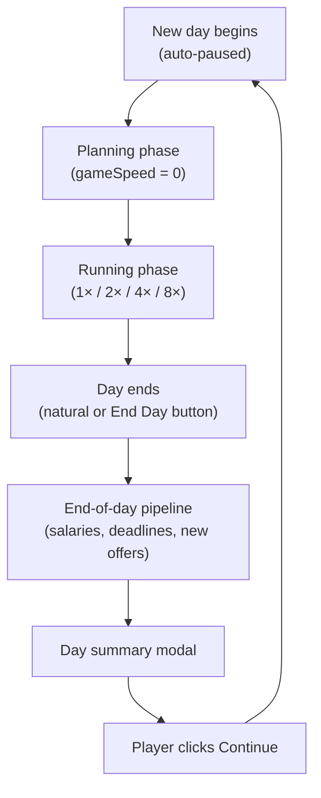
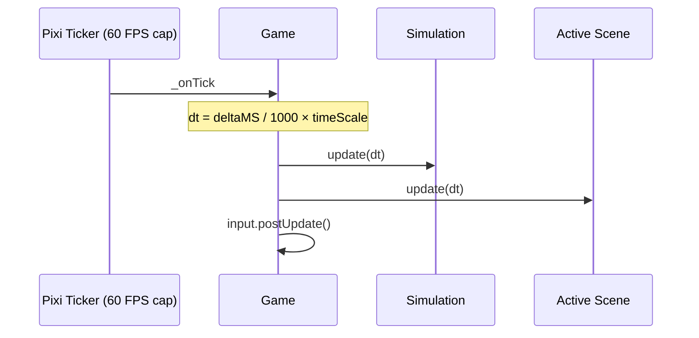
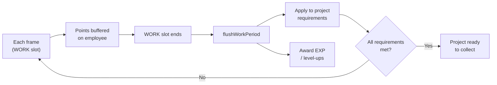
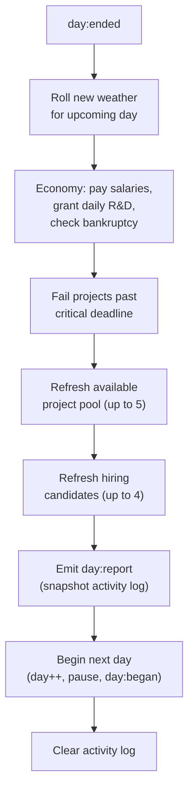

# Game Loop

This document describes how time flows in **Software Empire**: the engine tick, the day cycle, what happens while a day runs, and what happens when a day ends.

For wiring diagrams and module structure, see [ARCHITECTURE.md](./ARCHITECTURE.md).

---

## Overview

The game is built around **days**. Each day has two phases:

1. **Planning phase** — The simulation is paused. The player reviews finances, hires staff, accepts projects, assigns employees, unlocks research, and (if the Schedule research node is unlocked) adjusts the work schedule.
2. **Running phase** — The player unpauses (or picks a speed). Time advances, employees follow a repeating schedule, and assigned workers contribute story points to pinned projects.

When the day finishes—either because real time runs out or the player clicks **End Day**—a chain of end-of-day systems runs, a **day summary** is shown, and the next day begins paused again.



---

## Engine frame loop

Every frame, PixiJS calls `Game._onTick`. This drives both simulation logic and presentation.



### What runs each frame

| Step | What happens |
|------|----------------|
| **Simulation.update** | If speed > 0: project work accrues into employee buffers; day progress advances |
| **Scene.update** | Employee schedule slots update; WORK periods flush; entities animate; HUD refreshes every 0.2s |
| **Input.postUpdate** | Clears one-frame input flags |

### Two different “speed” knobs

| Setting | Where | Effect |
|---------|-------|--------|
| `GameConfig.loop.timeScale` | Global config (default `1`) | Scales raw frame delta before anything else sees it |
| `TimeSystem.gameSpeed` | Player-controlled | `0` = paused, `1` = normal day speed, up to `8` = fast-forward |

When paused (`gameSpeed = 0`), the day clock does not advance and no project work accrues—but the UI, input, and animations tied to real time still update.

---

## One in-game day

### Duration

At **1× speed**, one full in-game day takes **180 real seconds** (3 minutes).

Day progress is stored as `dayProgress` from **0** (start) to **1** (end). The in-game clock shown in the top bar is derived from:

- `company.schedule.startHour` — when the work day begins (default 9 AM, configurable 6 AM–4 PM after Schedule research)
- `company.schedule.workHours` — shift length (default 12 h / 9 AM–9 PM, configurable 8 / 10 / 12 / 14 after Schedule research)
- `dayProgress` — how far through the shift you are

The displayed clock snaps to **:00, :15, :30, :45**.

### Starting a day

When a new day begins:

- `company.day` increments
- `dayProgress` resets to `0`
- `gameSpeed` is set to **`0` (auto-pause)** so the player can plan
- The **Start Day** button appears; **End Day** is hidden

The player presses **Start Day** (sets speed to 1×) or picks a speed preset manually.

### Ending a day

A day ends when either:

- `dayProgress` reaches `1` while time is running, or
- The player clicks **End Day**, which immediately jumps to end-of-day

Both paths emit the same `day:ended` event and run the same pipeline.

---

## While the day runs

### Employee schedule

Every employee shares the same repeating 15-minute cycle:

```
WORK → BATHROOM_BREAK → WORK → TALK → (repeat)
```

`ScheduleSystem.tick()` derives the current slot from day progress and the company's shift length, sets every employee's `scheduleState`, and fires per-activity handlers on slot transitions.

| Activity | Icon | Can contribute to projects? | Slot hook |
|----------|------|-----------------------------|-----------|
| WORK | 💻 | Yes (if assigned) | `onPeriodEnd` → flush SP |
| BATHROOM_BREAK | 🚻 | No | `onPeriodStart` (stub for future) |
| TALK | 💬 | No | `onPeriodStart` → pair employees, update friendship |

### Assignment rules

Employees only work when the player has **pinned** them to an active project (`pinnedProjectId`). Unassigned employees stay idle even during WORK slots.

Additional rules:

- The pin is ignored if the project is complete, ready to collect, or no longer active
- The pin is dropped if the employee has no matching skill for remaining requirements
- Only skills that match **open** requirements (not yet filled) contribute

### How project progress accrues

During each frame in a WORK slot, the **ProjectSystem** calculates contribution per matching skill:

```
contribution = SKILL_SP_TABLE[skillLevel]
             × (dt × gameSpeed / workPeriodSeconds)
             × baseProductivity
             × weatherModifier
```

Points are **buffered** on the employee (`workBuffer`)—they are not applied to the project immediately.

### WORK period flush

At the end of each **WORK** slot, `ScheduleSystem` detects the slot change and the `WORK` end-handler calls `flushWorkPeriod`:

1. Buffered points are written to project requirements
2. If all requirements are met, the project becomes **ready to finish** (milestone tier and payout are locked in)
3. Employees who contributed receive **EXP**; enough EXP triggers a **level-up** and a skill point



### Productivity modifiers

Each employee has a permanent **base productivity** trait (roughly 0.85–1.05), rolled at hire.

Each day also rolls a **weather** state with a global modifier. Weather is re-rolled at the start of the end-of-day pipeline (before the next playable day).

### Collecting finished projects

When a project becomes ready, the player must **collect** it manually from the Projects panel. Collection:

- Pays the milestone-adjusted payout plus a full **insurance refund**
- Moves the project to completed history
- Releases employees pinned to that project

Payout is applied **immediately** on collect—not at end-of-day.

---

## End-of-day pipeline

When `day:ended` fires, systems run **in this order**:



### Economy (salaries & warnings)

At day end:

- **Salaries** are deducted for every employee
- **R&D points** accrue at the daily rate (`rdPointsPerDay`)
- **Low funds** warning if cash drops below $5,000 (but above $0)
- **Bankruptcy** if cash reaches $0 or below (`economy:bankrupt`)

### Project deadlines

After salaries, any active project that has exceeded its **critical** milestone deadline (and is not already ready to finish) **fails**:

- Removed from active projects
- Insurance is **forfeited** (not refunded)
- Pinned employees are released

### Fresh daily offers

- **Available projects** are fully replaced—unaccepted offers from today are discarded
- Up to **5** new projects are generated by `ProjectGenerator` using the current team's daily SP output and a weighted random difficulty (Common / Uncommon / Rare)
- A catalog entry already running as an active project is excluded; completed entries can appear again

- **Hiring candidates** are fully replaced with up to **4** new candidates generated by `EmployeeGenerator` with skills filtered to `unlockedResearch`

### Day summary modal

Before the calendar advances, the simulation snapshots the activity log and company state and emits `day:report`. The **Day Summary** modal shows:

- End-of-day balance and net financial change
- Projects completed, failed, or still active
- Full scrollable activity log for that day

The player dismisses the modal to continue. Only then does `beginNextDay` run and the next planning phase start.

On `day:began`, the live activity log is **cleared** so the sidebar starts fresh; the report already captured the previous day’s log.

---

## Player actions and when they apply

| Action | When it takes effect |
|--------|----------------------|
| Accept / reject project | Anytime while paused or running |
| Assign / unassign employee | Anytime |
| Hire / fire | Anytime (subject to desk space) |
| Collect finished project | Anytime |
| Spend skill point on upgrade | Anytime |
| Unlock research | Anytime |
| Buy desk | Anytime |
| Change work schedule | Anytime |
| Set game speed / Start Day | Anytime |
| End Day | Only while the day is running |

Most strategic decisions are intended during the **planning phase**, but nothing hard-blocks changes mid-day except what the UI implies (e.g. End Day only visible while running).

---

## Notifications & feedback

Most significant events emit `notification:add`, which:

- Appends to the **activity log** (sidebar widget, max **100** entries)
- Spawns a **toast** in the office scene

Examples: salaries paid, project ready, level-up, hire/fire, low funds, bankruptcy, project failed.

The end-of-day report uses a **snapshot** of notifications taken before the log is cleared.

---

## Timing reference

| Constant | Value | Meaning |
|----------|-------|---------|
| `DAY_DURATION_SECONDS` | 180 | Real seconds for one day at 1× |
| `SPEED_PRESETS` | 0, 1, 2, 4, 8 | Pause and speed multipliers |
| `DEFAULT_SPEED` | 0 | Speed when entering office / new day |
| `AVAILABLE_PROJECT_POOL_SIZE` | 5 | New project offers per day |
| `CANDIDATE_POOL_SIZE` | 4 | New hire candidates per day |
| `ACTIVITY_LOG_MAX` | 100 | Max entries in live activity log |
| `EXP_PER_TICK` | 10 | EXP per WORK flush with contribution |
| `xpRequiredForLevel(n)` | `floor(100 × 1.25^(n-1))` | EXP needed to advance from level n (100 at lv.1, 125 at lv.2, 156 at lv.3, …) |
| Schedule cycle | 4 × 15 min | WORK → BATHROOM_BREAK → WORK → TALK per hour block |
| HUD refresh | every 0.2 s | Top bar, widgets, open panels |

### Example: 8-hour shift at 1× speed

- 8 hours × 4 slots/hour = **32** fifteen-minute slots per day
- Each slot ≈ `180 / 32` ≈ **5.6 real seconds**
- Each WORK flush window ≈ **5.6 s** of real time at 1× (two WORK slots per hour)

---

## Event flow cheat sheet

| Event | When |
|-------|------|
| `day:tick` | Every frame while time is running |
| `day:ended` | Day completes (natural or End Day) |
| `day:report` | After end-of-day systems, before next day starts |
| `day:began` | Next day starts (paused) |
| `project:completed` | Project requirements met (ready) **or** payout collected |
| `project:failed` | Past critical deadline at day end |
| `employee:levelup` | EXP threshold crossed on WORK flush |
| `economy:bankrupt` | Cash ≤ $0 after salaries |
| `simulation:reset` | New game |

---

## Mental model

Think of the loop as three nested clocks:

1. **Frame clock** — 60 FPS; drives rendering, input, and simulation steps
2. **Day clock** — 0→1 over 180 s at 1×; controls salaries, offers, and deadlines
3. **Schedule clock** — 15-minute slots within the shift; controls when WORK happens and when buffered points flush

The player’s job each loop iteration: **plan while paused → run the day → read the summary → repeat**, keeping cash flow positive, projects on milestone, and staff assigned during WORK slots.
